# Impulse

Impulse is a Visual Studio Code Extension that boosts Near Protocol developers' productivity by providing a user interface that reduces the amount of time required to perform common tasks such as creating a Near project, running test and build scripts, deploying and calling smart contracts, network switching, and account management.

## Features

- Creating a Near project
  - Creating a new project using `npx`
  - Cloning an existing Repository
- Running Test scripts
- Running Build scripts
- Deploying smart contracts
- Calling smart contracts
  - Calling view methods
  - Calling change methods
- Account Management
  - Creating account
  - Getting account state
  - Sending tokens
  - Deleting account
- Multi network support
- Multi project support

**Creating a Near project**

**Creating a new project using `npx`**

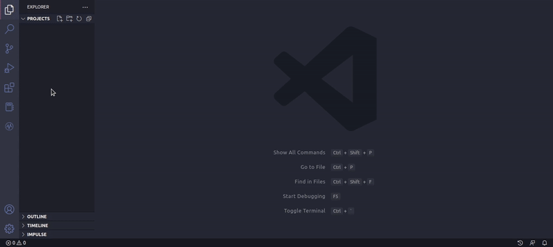

Cloning an existing Repository

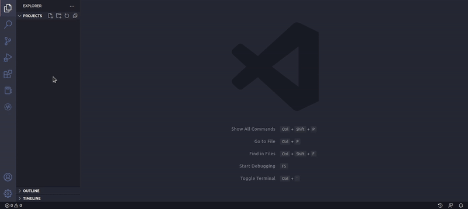

**Running Test scripts**

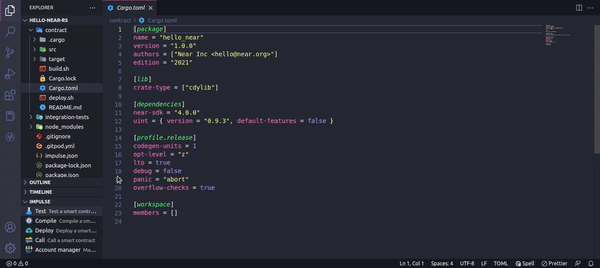

**Running Build scripts**

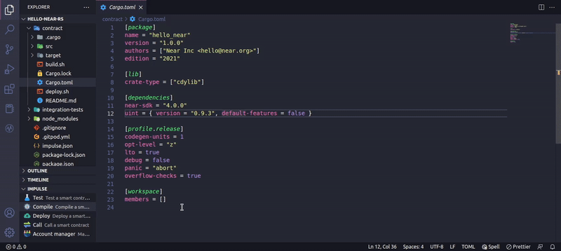

**Deploying smart contracts**

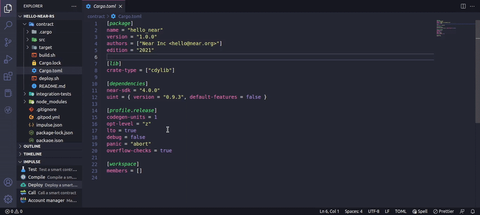

**Calling smart contracts**

**Calling view methods**

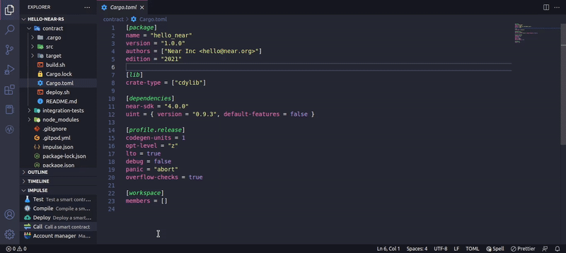

**Calling change methods**

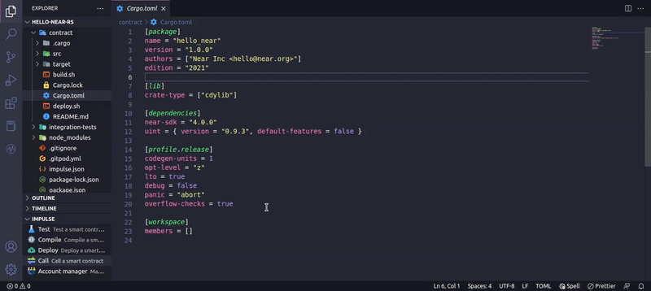

> Note: To call smart contracts you should create in your project's root directory a file named `impulse.json`, and inside it declare your view and change methods. For more information on how to declare the methods please read the impulse.json.md file.

**Account Management**

**Creating account**

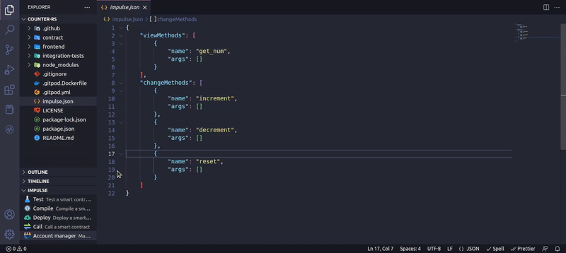

**Getting account state**

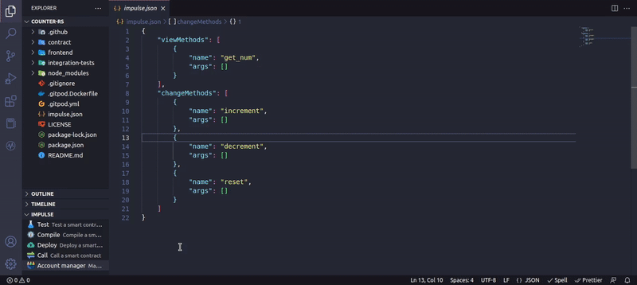

**Sending tokens**

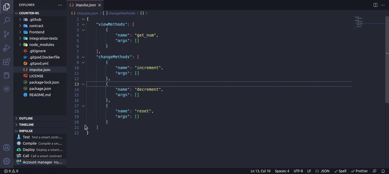

**Deleting account**

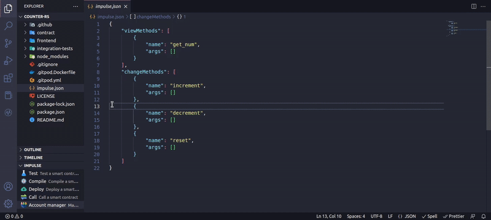

**Multi network support**

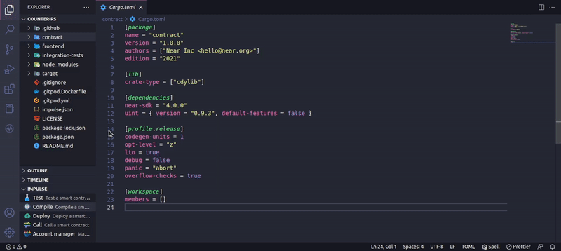

**Multi project support**

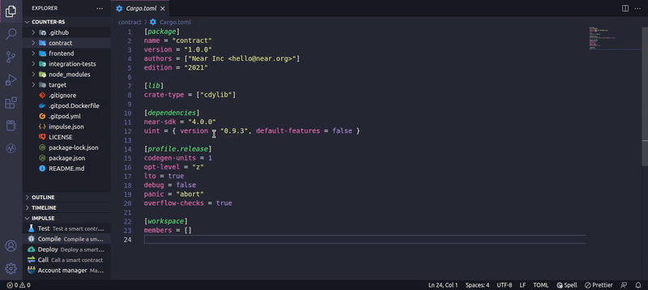

## Requirements

### Tools

In order to use this extension you must have the following tools installed:

- [Node.js](https://nodejs.org/en/) : this tool will be used to create a new Near project.
- [Near CLI](https://docs.near.org/tools/near-cli): this tool will be use to interact with the Near Network.
- [Bash](https://www.gnu.org/software/bash/) (Except Windows OS users): this is the shell that Impulse uses to call the Near CLI.

After installing the Near CLI, use the command `near login` to add your Near accounts to the `.near-credentials` directory. Impulse will only recognize accounts stored in this directory.

### Project structure

This extension requires that you a have a Near project structure that looks similar to this:

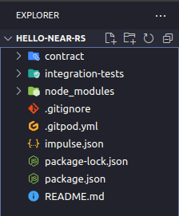

Your project's root directory should have a `package.json` file, an `impulse.json` file, and a directory named `contract`.

### Network switching

To use Near Localnet you must use Kurtosis to set it up locally or in a remote machine.

## Extension Settings

This extension contributes the following settings to configure the Near Localnet (Kurtosis):

- `impulse.localnet.nearEnv`: Used to set the Near localnet Near environment.
- `impulse.localnet.nearCLILocalnetNetworkId`: Used to set the Near localnet network id.
- `impulse.localnet.nearNodeURL`: Used to set the Near localnet node URL.
- `impulse.localnet.nearCLILocalnetKeyPath`: Used to set the Near localnet validator key path.
- `impulse.localnet.nearWalletURL`: Used to set the Near localnet wallet URL.
- `impulse.localnet.nearHelperURL`: Used to set the Near localnet helper URL.
- `impulse.localnet.nearExplorerURL`: Used to set the Near localnet explorer URL.
- `impulse.testnet.nearEnv`: Used to set the Near testnet environment

This extension also contributes the following settings to configure the Near Testnet:
- `impulse.testnet.nearEnv`: Used to set the Near testnet environment.
- `impulse.testnet.nearCLITestnetRPCServerURL`: Used to set the Near testnet RPC server URL.
- `impulse.testnet.nearWalletURL`: Used to set the Near testnet wallet URL.
- `impulse.testnet.nearHelperURL`: Used to set the Near testnet helper URL
- `impulse.testnet.nearHelperAccount`: Used to set the Near testnet helper account.
- `impulse.testnet.nearExplorerURL`: Used to set the Near testnet explorer URL.

## Release Notes

### 1.0.0

Initial release of Impulse.
