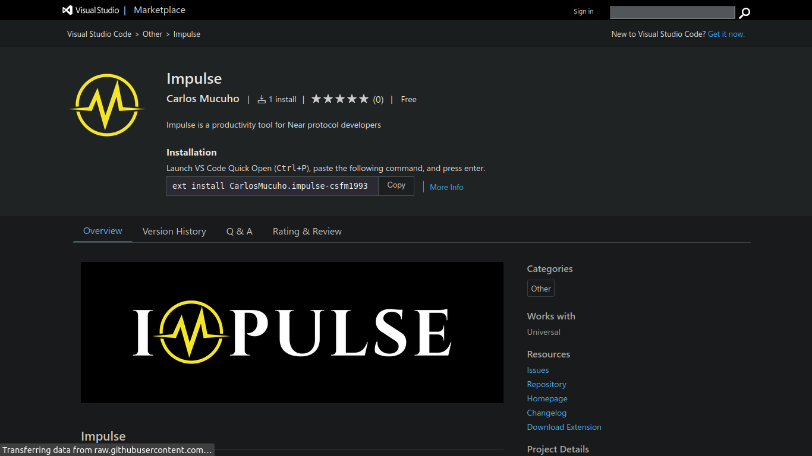

# How to run

There are two ways you can run this extension:
- Installing the extension published in the marketplace
- Cloning the repository and running the extension in development mode.


## Installing the extension published in the marketplace

Open VS Code, click on "Extensions" and search for an extension named `impulse` published by Carlos Mucuho. Click on on install and you are all set.

Or

Open VS Code, launch VS Code Quick Open (Ctrl+P), paste the following command, and press enter :

```bash
ext install CarlosMucuho.impulse-csfm1993
```




## Cloning the repository and running the extension in development mode

Clone [this repository](https://github.com/CSFM93/impulse):

```bash
git clone https://github.com/CSFM93/impulse.git
```

Navigate in to the directory:

```bash
cd impulse
```

Install the dependencies:

```
npm install
```

Open the directory using VS Code:

```bash
code .
```

Once VS code opens the directory click on "Run and debug" to run the extension on development mode.